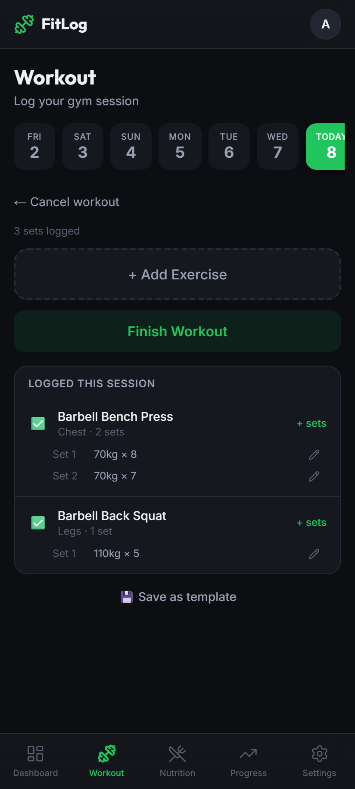
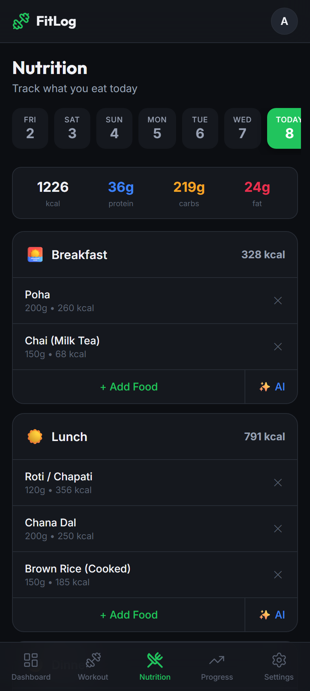
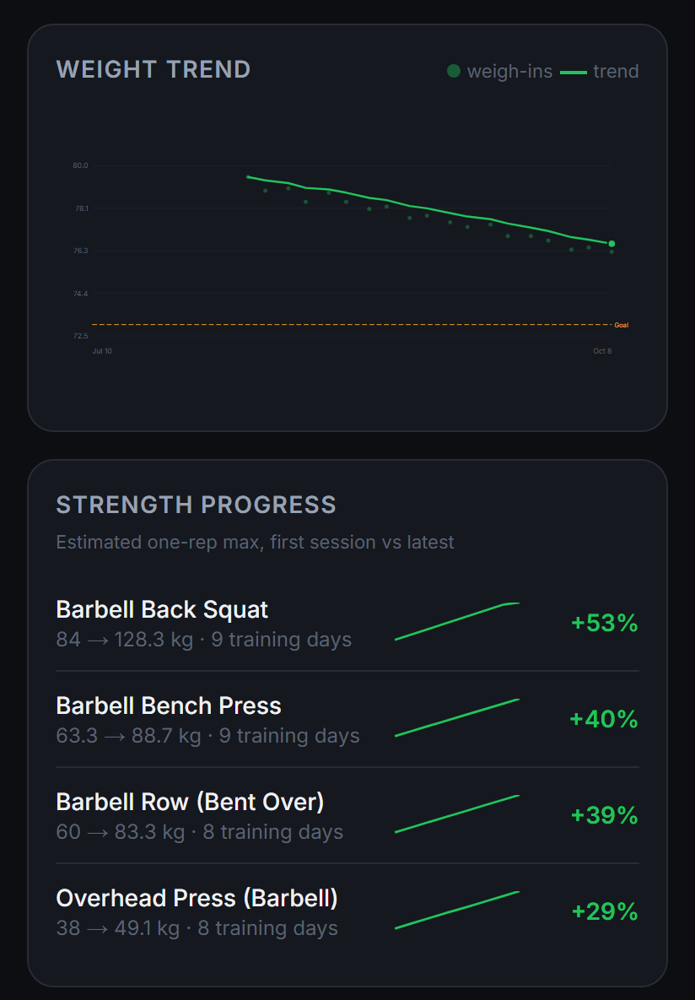
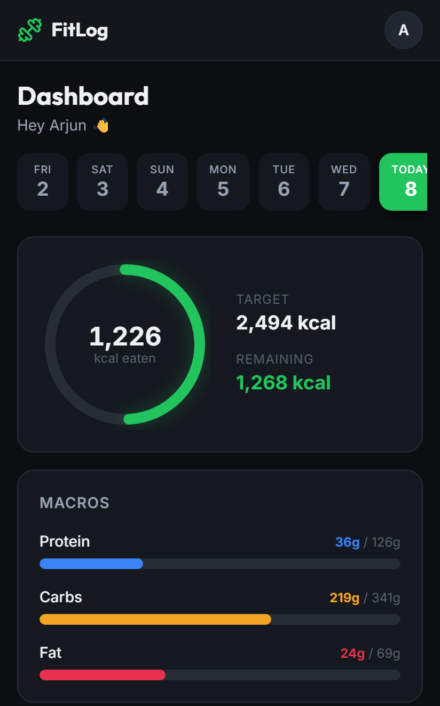
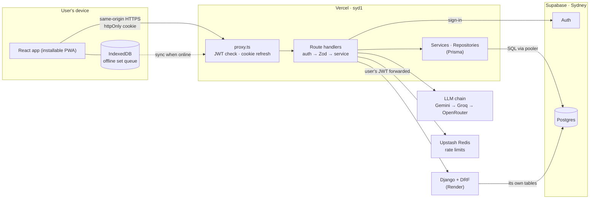

# FitLog

**A workout and nutrition tracker for Indian gym-goers, with offline set logging, Indian food data, and AI-assisted logging.**

[](https://github.com/VaibhavGarg2003/FitLog/actions/workflows/ci.yml)

**[Live app →](https://myfitlog.vaibhav03.codes)** &nbsp;·&nbsp; **[Django service repo →](https://github.com/VaibhavGarg2003/fitlog-django)**

Built with Next.js 16, Django and Postgres. 410 unit tests pass, and offline set retries are deduplicated in the database.

> **Trying it?** Use **Continue with Google**, the fastest way in. It's installable on Android from the landing page.

<table>
  <tr>
    <td align="center"><br><sub>Live workout logging</sub></td>
    <td align="center"><br><sub>Indian food logging</sub></td>
  </tr>
  <tr>
    <td align="center"><br><sub>Weight trend and strength progress</sub></td>
    <td align="center"><br><sub>Daily targets</sub></td>
  </tr>
</table>

<sub>Screenshots show fictional demo data from the development environment.</sub>

---

## What it does

- **Logs workouts as they happen.** Pick from a 155-exercise catalog and log sets during the session, or afterwards. Save any session as a reusable template.
- **Keeps working in a basement gym.** Sets logged with no signal are stored on the phone and sync when the app is open and back online. Retrying a set never inserts it twice.
- **Understands Indian food.** 148 seeded foods (116 with Hindi names) in real serving units: *roti*, *katori*, *glass*. Mark a meal as restaurant food and its calories are scaled by that food's restaurant multiplier. You can also save your own foods.
- **Calculates safe targets.** A pure-function engine computes calories and macros from Mifflin-St Jeor BMR and activity-based TDEE. No target goes below your BMR, a 1,200 kcal (female) / 1,500 kcal (male) floor, or a 25% maximum deficit, whether you're losing, maintaining or gaining.
- **Turns descriptions into logs.** Type *"bench 4 sets 40x12, 50x10…"* and AI workout parsing produces a **draft you review** before anything is saved. AI meal parsing (*"2 roti, dal and curd"*) validates the reply and logs the matched foods straight away.
- **Reports on finished periods.** The Progress tab shows weight trend, estimated one-rep max per lift and a consistency grid, all computed by code. Weekly, monthly, quarterly and yearly AI reports summarise those numbers in writing.
- **Shares plans publicly.** A workout template becomes a public link that previews properly in WhatsApp. Friends can copy it into their own account.

## Architecture

Two services and one Postgres database. Application data always goes through same-origin Next.js routes.



- **No tokens in JavaScript.** Credential and OAuth code exchanges run server-side, and the session lives in an `httpOnly` cookie ([cookie-options.ts](lib/supabase/cookie-options.ts)).
- **Layered.** Route handlers only do HTTP: authenticate, validate with Zod, map errors. Services hold the business rules. Business-data access lives in repositories. The calorie engine ([lib/engine](lib/engine)) is pure maths with no I/O.
- **Server-side integrations.** Next.js calls Django, the LLM providers and Redis server-to-server. Django verifies the same Supabase JWT, which Next.js forwards ([django.service.ts](lib/services/django.service.ts)). Browser-side third-party traffic is limited to Google sign-in, the CAPTCHA widget, error reporting and WhatsApp share links.

## Engineering highlights

### 1. Offline set retries are deduplicated
Gym Wi-Fi drops, taps get doubled, and two tabs can be open at once. Logging a set goes through these steps:

1. It's written to an **IndexedDB outbox** first, with a client-generated request id. Its order number is assigned **inside the same IndexedDB transaction**, so two tabs can't get the same one ([outbox-store.ts](lib/offline/outbox-store.ts)).
2. A drainer sends queued sets in order, retrying temporary failures after 2s → 5s → 15s → 60s. Where Web Locks are available, only one tab drains the queue at a time ([drain.ts](lib/offline/drain.ts), [transport.ts](lib/offline/transport.ts)).
3. On the server, one `SELECT … FOR UPDATE` checks ownership, existence and that the workout is still open. A replayed request id returns the row that's already saved, and the set number is assigned as *max + 1* under the lock. Unique constraints back up both rules ([workout.repository.ts](lib/repositories/workout.repository.ts)).
4. If someone signs in as a different user in another tab, queued sets aren't sent under the wrong account ([expected-user.ts](lib/utils/expected-user.ts)).

There's a regression test for the hardest case: a set that commits just as the workout is finished ([add-set-replay.test.ts](lib/repositories/add-set-replay.test.ts)).

### 2. Diagnosing a slow set save
Saving one set took **~2.9 s** in production. The `X-Vercel-Id` header (`bom1::iad1`) showed the request entering in Mumbai but **running in Washington DC**, while the database is in **Sydney**. The save path makes several sequential database round trips, and each one paid that distance.

Functions are now pinned to `syd1`, next to the database ([vercel.json](vercel.json)). The investigation and latency estimates are in [DEPLOY_REGION.md](docs/DEPLOY_REGION.md).

### 3. Two services, one database, permissions enforced by Postgres
The Django service owns `share_links` in the same Postgres, and a stray Prisma command could otherwise treat those tables as drift and drop them. Instead of relying on discipline, permissions are split across database roles ([db/roles](db/roles/README.md)):

| Role | Can | Cannot |
|---|---|---|
| `fitlog_app` (runtime) | read and write app tables | change the schema · read Django's tables · delete users |
| `fitlog_migrate` (migrations) | change Prisma's own tables | drop the schema · directly alter Django-owned tables |
| `fitlog_deleter` | run one account-deletion function | access application tables directly |

- **The cross-service foreign key is guarded.** DDL triggers check that registered cross-service foreign keys stay in place, with `postgres` as the explicit break-glass exception.
- **Supabase's public REST API is closed.** Application tables in `public` have RLS on with no policies, so the `anon` and `authenticated` roles can't read any rows. An event trigger also tries to switch RLS on for every new `public` table ([000_rls_auto_enable.sql](db/roles/000_rls_auto_enable.sql)).
- **Each user's data is separated by the app.** The runtime role bypasses RLS, so ownership checks in the server code do that job.
- **One intentional cross-service effect:** deleting a user cascades into their Django share links ([db/roles](db/roles/README.md) documents this).

### 4. AI output is treated as untrusted input
- **A fallback chain under a time budget.** Gemini → Groq → OpenRouter. Meal and workout parsing give each provider 4s + 2s + 2s; reports use a longer budget. If every provider fails, you can still log manually ([fallback.ts](lib/ai/fallback.ts)).
- **Workout replies are checked set by set.** Numbers are coerced and range-checked. An invalid set (say, a hallucinated 9000 kg lift) is dropped with a warning, and the valid sets around it are kept ([ai-workout.service.ts](lib/services/ai-workout.service.ts)).
- **Deterministic exercise matching.** Gym shorthand ("OHP", "ham curls", Hinglish like *"bench lagaye"*) is matched without AI. Ambiguous words like "row" or "curl" are never auto-accepted; any suggested match needs your review ([exercise-aliases.ts](lib/ai/exercise-aliases.ts)).
- **Reports: code does the maths, AI writes the summary.** Zod checks the reply's structure and length, but not whether the prose is factually right. A database lease stops two taps from paying for two AI calls ([insight.service.ts](lib/services/insight.service.ts)).
- **Rate limits (with Redis available):** 15 meal parses and 10 workout parses per user per rolling day, and 16 report generations per rolling 30 days. Each report period also has a database-backed attempt cap.

## Tech stack

| Layer | Tools |
|---|---|
| App | Next.js 16 (App Router) · React 19 · TypeScript (strict) · Tailwind CSS 4 |
| Data | Supabase Postgres + Auth · Prisma 7 with `@prisma/adapter-pg` · TanStack Query · Zustand |
| Offline / PWA | IndexedDB (`idb`) · Web Locks · BroadcastChannel · service worker · web app manifest |
| Second service | Django 5 · Django REST Framework · [fitlog-django](https://github.com/VaibhavGarg2003/fitlog-django) |
| Platform | Vercel (`syd1`) · Render · Upstash Redis · Sentry · Cloudflare Turnstile |
| Quality | Vitest · ESLint · GitHub Actions |

## Testing and CI

- **410 passing unit tests** across the calorie engine, validators, offline queue, repositories and AI parsing. Another **20 integration tests** run against a real Postgres.
- **CI runs on pushes to `main` and on pull requests targeting `main`** ([ci.yml](.github/workflows/ci.yml)): type-check → lint → tests → Prisma validation → a **migration drift check**, which replays every migration into a throwaway Postgres 16 and diffs it against the schema → production build.

```bash
npm test                                        # unit tests
# integration tests: apply the migrations to a disposable Postgres first, then
TEST_DATABASE_URL=postgresql://… npm test
```

## Trade-offs and next steps

- **Offline covers logging sets, not the whole app.** The service worker caches only the offline fallback page and never caches API responses or app assets. Queued sets live in IndexedDB until they sync.
- **Running two services has a cost.** Django handles public sharing, which adds a second deployment, free-tier cold starts and cross-service database constraints.
- **Integration tests aren't in CI yet.** Running them against CI's Postgres container is the next step.
- **Email signup needs a custom email provider.** Supabase's built-in sender only delivers to project members, so Google sign-in is the recommended path for now.

## Run it locally

**You need:** Node.js 22 and a Supabase project (Postgres + Auth).

```bash
git clone https://github.com/VaibhavGarg2003/FitLog.git
cd FitLog
npm install
cp .env.local.example .env.local   # then fill in the values below
npx prisma generate                # generate the Prisma client
npx prisma migrate deploy          # create the schema
npm run db:seed                    # foods + exercises catalog
npm run dev                        # http://localhost:3000
```

The Settings "sign-in methods" card needs the `private.user_has_password()` helper, and account deletion needs `private.delete_user_account()`. Both live in the SQL under [db/roles](db/roles/README.md), which also sets up the production roles. Apply those scripts in the order that README describes, relative to the migrations.

| Variable | Needed for |
|---|---|
| `NEXT_PUBLIC_SUPABASE_URL`, `NEXT_PUBLIC_SUPABASE_ANON_KEY` | Auth |
| `DATABASE_URL` (pooler) · `DIRECT_URL` (direct, for migrations) | Database |
| `GEMINI_API_KEY`, `GROQ_API_KEY`, `OPENROUTER_API_KEY` | AI parsing and reports (at least one provider) |
| `UPSTASH_REDIS_REST_URL`, `UPSTASH_REDIS_REST_TOKEN` | Rate limits (disabled if unset) |
| `DJANGO_URL` | Share links (the Django service) |
| `ACCOUNT_DELETION_DATABASE_URL` | Optional: account deletion (needs the dedicated role and function) |
| `SENTRY_DSN`, `NEXT_PUBLIC_SENTRY_DSN` | Optional: server and browser error reporting |
| `SENTRY_AUTH_TOKEN`, `SENTRY_ORG`, `SENTRY_PROJECT` | Optional: source-map uploads |
| `NEXT_PUBLIC_TURNSTILE_SITE_KEY` | Optional: CAPTCHA on sign-in |
| `CRON_SECRET` | Optional: protects `/api/health` |

## Project structure

```
app/                 pages (App Router) and API route handlers (app/api)
lib/engine/          calorie and macro engine: pure functions
lib/services/        business rules
lib/repositories/    business-data access (Prisma, transactions, locks)
lib/offline/         IndexedDB outbox, drainer, cross-tab lock
lib/ai/              LLM clients, fallback chain, exercise matching
prisma/              schema, migrations, seed data
db/roles/            least-privilege roles and database guards
proxy.ts             session refresh and route protection for matched requests
```

---

Built by **Vaibhav Garg** · [GitHub](https://github.com/VaibhavGarg2003)
