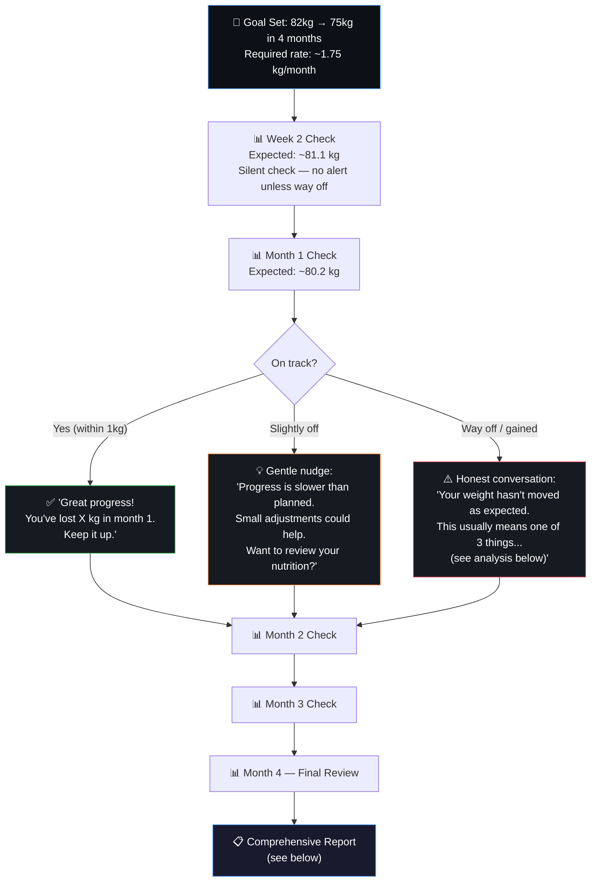
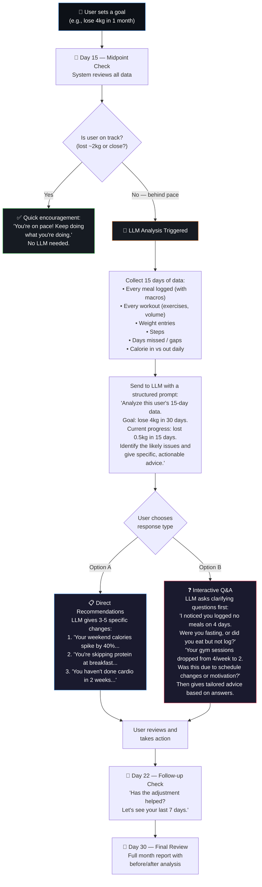

# 🏋️ FitLog — Answers to Your Questions

---

## Q1: Logging Timing — Users Log Whenever They Want

You're absolutely right, and I need to correct my earlier user journey diagram. I showed a neat "morning → lunch → gym → dinner" flow which is **idealized nonsense**. Real people don't work that way.

### The Reality:

| User Type | When They Log | How They Log |
|-----------|--------------|-------------|
| **The Real-Timer** | During the workout, between sets | Logs each set as it happens |
| **The Post-Workout Logger** | Right after finishing the session | Logs everything from memory in one go |
| **The Night Dumper** | At 11 PM before bed | Logs the entire day — all meals + workout — in one sitting |
| **The Next-Day Logger** | Next morning | "Oh I forgot to log yesterday" — back-fills everything |
| **The Meal Prepper** | Before eating | Logs planned meals in advance to check macros |
| **The After-Eater** | After finishing the meal | Logs what they actually ate |
| **The Weekend Batch Logger** | Sunday evening | Fills in 2-3 missed days at once |

### Design Implications — What This Changes:

**1. No time assumptions anywhere in the UI.**
- The dashboard says "Today" not "Good morning" or "Good evening"
- Logging screens never say "Log your breakfast" by default — they say "Log a meal" and the user picks the meal slot
- No judgment on WHEN something is logged. A workout logged at midnight for today is just as valid as one logged at 6 PM

**2. Every log must have a DATE picker (defaulting to today).**
- If user is logging yesterday's workout at 10 AM today → they pick "yesterday" from a simple date selector
- Meals logged at night should default to today's slots but allow changing the date
- This is a small dropdown/calendar, NOT a form field. One tap to change, invisible if you don't need it

**3. Meal slots should be flexible, not sequential.**
- Don't enforce "you must log breakfast before lunch"
- User can log dinner first, then come back and log lunch
- Meal slots: Breakfast | Snack | Lunch | Snack | Dinner — but they're **buckets**, not a sequence
- A user can leave breakfast empty and that's fine. No red flags, no "you forgot breakfast!" prompts

**4. Workout logging must work in TWO modes:**

| Mode | How It Works | Best For |
|------|-------------|----------|
| **Live Mode** | Timer running, log sets as you do them, rest timer between sets | Real-timers who log during workout |
| **Recall Mode** | No timer, no rest tracking. Just enter: exercise → sets × reps × weight. Done. | Post-workout loggers, night dumpers, next-day loggers |

Both modes produce the same output: a completed workout session with exercises, sets, reps, and weights. The only difference is whether the app tracks duration/rest in real time or asks for total session duration afterward.

**In Recall Mode**, after entering all exercises, the app asks:
> "Roughly how long was this session? ⏱️"
> `[30 min] [45 min] [60 min] [75 min] [90 min] [Custom]`

One tap. Used for calorie estimation.

---

## Q2: The Indian Gym Rest-Time Problem — This Breaks Time-Based Calorie Calculation

This is the sharpest observation you've made, and it directly exposes a flaw in my calorie engine.

### The Problem:

A user does Push Day. The actual working time (sets being performed) is maybe 30-35 minutes. But the total gym time is 1.5 hours because:
- 3-5 minute rests between heavy compound sets (Indian gyms are social — people chat, check phones, wait for equipment)
- Walking between machines/stations
- Warming up, stretching
- Filling water, wiping sweat

If I calculate calories as `MET × bodyweight × 1.5 hours`, I'm **massively overestimating**. The user didn't do 1.5 hours of work — they did ~35 minutes of work and ~55 minutes of standing around.

### The Fix — Separate "Gym Time" from "Work Time":

> [!IMPORTANT]
> **We should NOT use total gym duration for calorie calculation.** This is where most apps quietly get it wrong, and it's worse for Indian users specifically because rest culture is different.

**Option A: Estimate work time from logged sets (My Recommendation)**

Instead of asking "how long was your session?", we CALCULATE the working time from what was logged:

```
For each exercise:
  work_time = sets × reps × avg_seconds_per_rep
  
  avg_seconds_per_rep by exercise type:
    Compound lifts (squat, bench, deadlift): ~4 sec/rep
    Isolation (curls, lateral raises): ~3 sec/rep  
    Machine exercises: ~3 sec/rep
    Cable exercises: ~3 sec/rep

  intra_set_rest = (sets - 1) × estimated_rest_per_set
    Compound heavy: 120 sec rest
    Compound moderate: 90 sec rest
    Isolation/machine: 60 sec rest

  exercise_time = work_time + intra_set_rest
  
Total session work time = sum of all exercise_times
```

**Example: Push Day**
| Exercise | Sets × Reps | Work Time | Rest Time | Total |
|----------|-------------|-----------|-----------|-------|
| Bench Press | 4 × 10 | 160 sec | 3 × 120 sec = 360 sec | 8.7 min |
| Incline DB Press | 3 × 12 | 144 sec | 2 × 90 sec = 180 sec | 5.4 min |
| Cable Flyes | 3 × 15 | 135 sec | 2 × 60 sec = 120 sec | 4.3 min |
| OHP | 4 × 8 | 128 sec | 3 × 120 sec = 360 sec | 8.1 min |
| Tricep Pushdown | 3 × 12 | 108 sec | 2 × 60 sec = 120 sec | 3.8 min |
| Lateral Raises | 3 × 15 | 135 sec | 2 × 60 sec = 120 sec | 4.3 min |
| **Total** | | | | **~34.6 min** |

Even though the user spent 1.5 hours in the gym, we calculate calories based on ~35 minutes of actual work + standard rest. The extra 55 minutes of chatting/scrolling don't inflate the number.

**This is the estimated active session time.** We use THIS for the MET calculation, not the total gym time.

**Option B: Ask the user to self-report (Backup)**

If we don't have enough logged sets to estimate (e.g., Recall Mode with rough data), we ask:
> "How much of that time was actual working/resting between sets vs. waiting/chatting?"
> `[Most of it was working] [About half] [Lots of breaks/waiting]`

And apply a multiplier: 0.9× / 0.6× / 0.4× to total reported duration.

**My recommendation: Use Option A by default (auto-calculate from logged sets). Fall back to Option B only in Recall Mode when the user didn't log detailed sets.**

### Updated Calorie Engine for Strength Training:

```
1. Calculate estimated_active_minutes from logged sets (Option A)
2. Get RPE from user (1-10, one tap)
3. Map RPE to effective MET (as defined in final plan)
4. Calories = (Effective_MET × 3.5 × bodyweight_kg) ÷ 200 × estimated_active_minutes
5. Show as range: ≈X–Y cal
```

This means:
- A guy who did Push Day in 55 minutes focused → and a guy who did the SAME exercises in 1.5 hours with long breaks → get the **same calorie estimate** (because the work done was identical)
- Which is **physiologically correct**. The extra standing around burns negligible additional calories compared to your NEAT/BMR baseline

---

## Q3: How Do We Get Steps From The User's Phone Into Our Website?

This is a real technical constraint. Let me be honest about what's possible and what's not.

### What a WEBSITE Can and Cannot Do:

| Method | Can a Website Do This? | Practical? |
|--------|----------------------|-----------|
| Read phone's built-in step counter directly | ❌ No — websites cannot access the phone's health sensors | — |
| Use the Web Pedometer/Sensor API | ⚠️ Technically exists but almost no browser supports it reliably | No |
| Pull from Google Fit API | ✅ Yes, via OAuth + REST API | Yes, but complex (Phase 2) |
| Pull from Apple Health | ❌ No — Apple Health has no web API, only native iOS SDK | Not possible for a website |
| Manual entry by user | ✅ Yes | Yes — simplest, works for everyone |

### My Recommendation — Phased Approach:

**Phase 1: Manual Entry (Simple, Works for Everyone)**

The user opens their phone's built-in health/step app (Samsung Health, Google Fit, Apple Health, Mi Fit — every phone has one), sees their step count, and types the number into FitLog.

UI:
```
👣 Today's Steps
[___________] (number input)
or Quick Pick: [3K] [5K] [7K] [10K] [12K]

"Check your phone's health app for today's count"
```

This takes 5 seconds. It's not glamorous, but it works on every device with zero API complexity.

**Phase 2: Google Fit Integration (Android Users)**

Google Fit has a REST API that a website CAN access:
1. User clicks "Connect Google Fit"
2. OAuth popup → user grants permission
3. Our backend reads daily step count from Google Fit API
4. Steps auto-populate on the dashboard

This works for **Android users** (majority of Indian users). It requires a backend (which we're adding in Phase 2 anyway for the LLM features).

**Phase 3: Apple Health via Shortcut (iPhone Users — Workaround)**

Apple Health has no web API, but we can work around it:
- Create an iOS Shortcut that reads today's steps from Apple Health and sends them to our website's API
- User installs the shortcut once, runs it daily (or automates it)
- This is hacky but functional

OR: If we ever build a native wrapper (PWA → TWA for Android, or a thin native app), we get full sensor access. But that's Phase 3+.

**Bottom line: Phase 1 = manual entry. It's honest, it works, it's 5 seconds. Don't over-engineer this.**

---

## Q4: Protein Goal Handling — The "20g Short" Problem

You nailed it — this is where most fitness apps are either uselessly generic ("you're 20g short!") or annoyingly preachy. Here's how I'd handle it:

### Step 1: Capture User's Strictness Level (During Onboarding or Settings)

Add ONE question to onboarding or settings:

> **How strict do you want to be with your nutrition targets?**
> 
> 🟢 **Relaxed** — "I'm doing my best, don't stress me about small gaps"
> 🟡 **Moderate** — "Tell me if I'm significantly off, but don't micromanage"
> 🔴 **Strict** — "I want to hit my numbers precisely. Hold me accountable"

This one setting changes ALL nutrition feedback across the entire app.

### Step 2: Different Responses Based on Strictness

**Scenario: User's protein goal is 100g. They logged 80g for the day.**

#### 🟢 Relaxed Mode Response:
> ✅ "Good day! You got 80g of protein — that's solid. Your body isn't counting to the gram, and neither should you."

That's it. No suggestion, no "you're short." 80% of a protein goal is genuinely fine for someone who isn't training competitively. The app should reflect that reality, not manufacture anxiety.

#### 🟡 Moderate Mode Response:
> 💡 "You're at 80g of 100g protein today. Pretty close! If you feel like it — a glass of milk (8g) or a small cup of curd (6g) before bed would top it off. But don't lose sleep over it."

Key: **suggestion is optional, tone is casual**, and it offers a SPECIFIC, easy Indian food suggestion — not "eat 20g more protein" (which is useless advice).

#### 🔴 Strict Mode Response:
> 🎯 "You're 20g short of your protein target. Quick options to close the gap:
> • 1 glass of milk + 1 boiled egg → 14g protein
> • 1 scoop whey shake → 24g protein  
> • 200g paneer → 18g protein
> • 1 cup chana → 12g protein
> Pick one and log it 💪"

Key: **specific quantities, specific foods, actionable**. This user WANTS to be held accountable.

### Step 3: Smart Thresholds (Not Just Protein)

This system applies to ALL macro/calorie targets:

| Gap Size | Relaxed | Moderate | Strict |
|----------|---------|----------|--------|
| **Within 90%+ of goal** | ✅ "Great job" | ✅ "Great job" | 💡 Gentle suggestion |
| **70-90% of goal** | ✅ "Good enough" | 💡 Optional suggestion | 🎯 Actionable fix |
| **50-70% of goal** | 💡 "A bit low today" | ⚠️ "Significantly under" | ⚠️ "Way under — here's how to fix" |
| **Below 50%** | ⚠️ "Very low today, try to eat more" | ⚠️ Strong suggestion | 🚨 "You're at half your target" |

### What We NEVER Do (Regardless of Strictness):
- ❌ Never say "You FAILED your goal"
- ❌ Never use red color for "under target" (use neutral or yellow)
- ❌ Never shame or guilt-trip
- ❌ Never say "you MUST eat more" — always frame as optional/suggested
- ❌ Never trigger for a single bad day — only flag patterns (3+ consecutive days significantly under)

---

## Q5: Long-Term Goal Failure — The 4-Month Problem

**Scenario**: User set a goal to go from 82kg → 75kg in 4 months. After 4 months, they're at 80kg (lost only 2kg) or even gained weight.

This is the hardest product problem in fitness apps, and most apps just... ignore it. They show you a graph going the wrong way and leave you to figure it out.

### Our Approach: Progressive Check-Ins, Not a 4-Month Surprise

> [!IMPORTANT]
> **Don't wait 4 months to tell someone they're off track.** That's cruel and useless. Check in progressively.

#### Checkpoint System:



#### When The User Is Off Track — What We Actually Tell Them:

The analysis looks at their logged data and identifies the most likely reason:

**Reason 1: Calorie logging gaps**
> "You logged meals on only 45 of the last 120 days. On days you didn't log, we can't tell if you were eating at a deficit. The most common cause of stalled fat loss is untracked eating — snacks, chai, restaurant meals that don't get logged."
> 
> **Suggestion**: "Try to log at least 5 out of 7 days. Even rough logging beats no logging."

**Reason 2: Calories are higher than they think**
> "Your average logged intake is 2,300 cal/day. Your estimated TDEE is 2,400 cal/day. That's only a 100 cal/day deficit — you'd lose about 0.4 kg/month at this rate, not 1.75 kg/month."
>
> **Suggestion**: "To lose 1.75 kg/month, you'd need a ~450 cal/day deficit. That means eating around 1,950 cal/day OR increasing activity to burn 350 more cal/day."

**Reason 3: Weekend/social eating undoing weekday discipline**
> "Your weekday average is 1,900 cal. Your weekend average is 2,800 cal. The weekend eating is canceling out your weekday deficit."
>
> **Suggestion**: "You don't have to give up weekend meals — just be aware they cost you ~3-4 days of progress each week."

**Reason 4: Workout inconsistency**
> "You worked out an average of 2.1 times/week. Your plan calls for 4-5 times/week."
>
> **Suggestion**: "Even 3 consistent sessions/week would significantly improve your progress."

**Reason 5: The goal itself was unrealistic**
> "Losing 7kg in 4 months requires a sustained ~450 cal/day deficit. Based on your logged data and activity level, a more realistic timeline might be 6-7 months."
>
> **Suggestion**: "Want to adjust your goal to a more sustainable pace? Slower progress sticks longer."

---

## Q6: Mid-Goal LLM Intervention — The 15-Day Smart Review

This is your best idea so far and I want to design it properly.

### How It Works:



### The Two Options Explained:

#### Option A: Direct Recommendations (No Questions)

The LLM gets all 15 days of data and produces a plain-language report:

> **📋 Your 15-Day Review**
>
> **Progress**: You've lost 0.5kg in 15 days. To hit your 4kg goal, you needed to lose ~2kg by now. Let's look at why.
>
> **What the data shows:**
>
> 1. **Your average daily intake is 2,150 cal, but your target is 1,800.** That's a 350 cal/day overshoot. Over 15 days, that's ~5,250 extra calories — enough to prevent ~0.7kg of fat loss.
>
> 2. **Weekday vs Weekend split**: Mon-Fri you average 1,900 cal (close to target). Sat-Sun you average 2,800 cal. The weekends are erasing your weekday work.
>
> 3. **Protein is consistently low**: You're averaging 62g/day against a 100g target. Low protein during a deficit means you're likely losing some muscle along with fat, which slows metabolism.
>
> 4. **Workouts are on track** — 3.5 sessions/week, good volume. This isn't the problem.
>
> **3 changes that would help most:**
> - Bring weekend calories down to ~2,200 (still higher than weekdays, just not 2,800)
> - Add a protein source to breakfast — even 2 boiled eggs or a glass of milk adds 12-15g
> - Consider one 20-min cardio session on weekends to offset the higher intake

#### Option B: Interactive Q&A (Questions First)

The LLM first asks the user questions to fill gaps in the data:

> **❓ Before I give advice, a few questions about your last 2 weeks:**
>
> 1. "I see 4 days with no meals logged. Were you fasting on those days, or did you eat but not log?"
>    - `[I ate but didn't log]` `[I was fasting]` `[I don't remember]`
>
> 2. "Your gym sessions dropped from 4/week in week 1 to 2/week in week 2. What happened?"
>    - `[Busy/schedule change]` `[Didn't feel like it]` `[Was sick/injured]` `[Other]`
>
> 3. "I see high-calorie entries on weekends (biryani, chole bhature, sweets). Are these social meals you can't avoid, or choices you can control?"
>    - `[Social/family — can't avoid]` `[My choice — I can adjust]` `[Mix of both]`

Then, based on answers, gives TAILORED advice:
- If they ate but didn't log → "The untracked days are likely hiding 1,500-2,500 cal each. Even rough logging on those days would help us give better estimates."
- If gym dropped due to motivation → Different advice than if it dropped due to injury
- If weekend meals are social → "Don't skip family meals. Instead, eat a smaller portion or skip the dessert/drink" vs. if it's their choice → "Try keeping weekend calories within 2,200"

### When This Triggers:

| Checkpoint | When | What Happens |
|-----------|------|-------------|
| **Silent check** | Every 7 days | System checks if weight trend matches goal pace. No notification if on track. |
| **Midpoint review** | At 50% of goal duration | If off pace → triggers LLM analysis. Offers Option A or B to user. |
| **Follow-up** | 7 days after midpoint review | Quick check: "Did the adjustments help?" |
| **Final review** | At goal end date | Full analysis: what worked, what didn't, next goal suggestion |

### What Data Gets Sent to the LLM:

```
{
  "user_profile": { age, gender, weight, height, goal, strictness_level },
  "goal": { start_weight, target_weight, duration, start_date },
  "current_progress": { current_weight, days_elapsed, weight_lost },
  "daily_logs": [
    {
      "date": "2026-06-01",
      "meals_logged": true/false,
      "total_calories": 2150,
      "protein": 62, "carbs": 280, "fat": 78,
      "workout": { type: "Push", duration: 55, rpe: 7, cal_burned: 340 },
      "steps": 6200
    },
    // ... 14 more days
  ],
  "weekly_averages": {
    "avg_calories": 2150,
    "avg_protein": 62,
    "avg_workouts_per_week": 3.5,
    "avg_steps": 6500,
    "weekday_avg_cal": 1900,
    "weekend_avg_cal": 2800
  },
  "logging_consistency": {
    "days_with_meals_logged": 11,
    "days_with_workout_logged": 7,
    "days_completely_empty": 2
  }
}
```

The LLM prompt includes instructions to:
- Be specific, not generic ("eat less" is banned — must say "bring weekend calories from 2,800 to 2,200")
- Suggest Indian foods specifically for protein/calorie fixes
- Never shame or guilt-trip
- Acknowledge what's going WELL before pointing out problems
- Respect the user's strictness level setting
- If the goal itself is unrealistic, say so honestly

### Phase Placement:

This whole system is **Phase 2** (requires a backend + LLM API). But we design the data logging in Phase 1 to capture everything the LLM will need later. Specifically:
- Daily calorie totals ✅ (Phase 1 captures this)
- Daily macros ✅
- Workout logs with volume ✅
- Weight entries ✅
- Steps ✅
- Logging consistency (which days were logged) ✅

---

## Summary: What Changes in the Design

Based on your questions, here are the concrete updates to the plan:

### 🔄 Changes to Existing Design:

| What | Was | Now |
|------|-----|-----|
| **Daily flow assumption** | Morning → lunch → gym → dinner (sequential) | Any time, any order. Date picker on every log. No time assumptions. |
| **Workout logging** | Only live mode (timer running) | **Two modes**: Live Mode (during workout) + Recall Mode (after workout/at night) |
| **Calorie burn: strength training** | Duration-based (gym time) | **Work-time estimated from logged sets** — ignores long rests/breaks. 1.5 hours gym time with 35 min work = calorie calc based on 35 min. |
| **Meal logging sequence** | Implied: log in order | No order enforced. Log dinner before breakfast if you want. Meal slots are buckets, not a sequence. |
| **Nutrition feedback** | One-size-fits-all "you're 20g short" | **3 strictness levels** (Relaxed / Moderate / Strict) — different tone, detail, and expectations per level |
| **Step count** | Vague "manual or device integration" | **Phase 1: Manual entry** (type number from phone's health app). **Phase 2: Google Fit API** (Android auto-sync). |

### ➕ New Additions:

| Feature | Phase | Description |
|---------|-------|-------------|
| **Strictness Level Setting** | Phase 1 | One setting that controls ALL nutrition feedback tone and detail |
| **Recall Mode for Workouts** | Phase 1 | Log entire workout after the fact, no timer needed |
| **Work-Time Calculator** | Phase 1 | Estimate active exercise time from sets/reps, ignore total gym time |
| **Progressive Goal Checkpoints** | Phase 2 | Silent weekly checks, midpoint review, follow-up, final review |
| **LLM Mid-Goal Analysis** | Phase 2 | At 50% of goal duration, if off track → LLM reviews all data |
| **Option A/B Response System** | Phase 2 | User chooses: direct recommendations OR interactive Q&A |
| **Google Fit Step Sync** | Phase 2 | OAuth + API for Android step auto-import |

