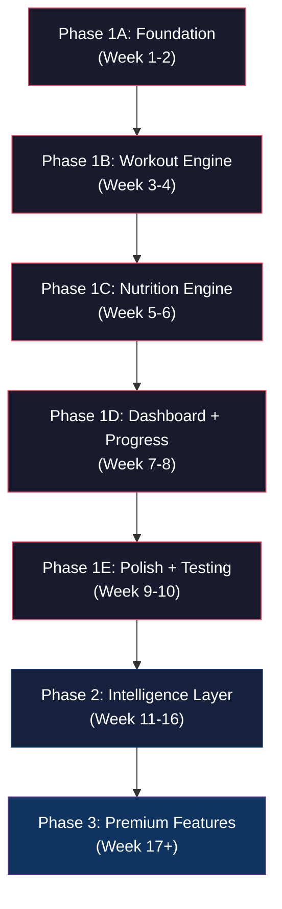

# 🏋️ Fitness App — Final Product Plan

## Part 1: Honest Head-to-Head Comparison

I'm going to call my original blueprint **Plan A** and the other agent's plan **Plan B**, then be brutally honest about who was right on each point.

---

### 1. Calorie Burn Engine

| Aspect | Plan A (Mine) | Plan B (Other Agent) | Verdict |
|--------|--------------|---------------------|---------|
| **Core formula** | `MET × Body Weight × Duration` | `(MET × 3.5 × bodyweight) ÷ 200` — the actual standardized equation | **Plan B is more precise.** My formula was a simplified version. Plan B uses the real Compendium of Physical Activities equation correctly. |
| **Strength training approach** | Try to compute from sets × reps × weight via MET ranges | Says this is fundamentally flawed — use session duration × MET × RPE instead, because calories correlate weakly with load lifted | **Plan B is right, and I was wrong.** Trying to derive calories from sets×reps×weight *sounds* rigorous but gives false precision. Session duration × effort level is what the science actually supports. RPE (1-10) after a session is one tap and more honest. |
| **Cardio machines** | Same MET table as outdoor cardio | Points out machines display their own calories/watts — let the user enter the machine's number instead of re-deriving it | **Plan B wins.** A rowing erg measuring actual power output is more accurate than any MET table I'd build. Machine override path is obvious in hindsight and I missed it. |
| **Intensity minutes** | Not mentioned | Track as a cross-cutting metric against WHO guidelines (150 moderate/75 vigorous per week) | **Plan B wins.** This is a genuinely useful and underserved metric. I completely overlooked it. |

**My original calorie engine section was oversimplified and slightly dishonest about strength training accuracy. Plan B's approach is physiologically more sound.**

---

### 2. TDEE / Calorie Target

| Aspect | Plan A (Mine) | Plan B (Other Agent) | Verdict |
|--------|--------------|---------------------|---------|
| **Initial calculation** | Mifflin-St Jeor × activity multiplier (standard) | Same starting point | Tied |
| **Ongoing accuracy** | Static — set once during onboarding, never updates | **Adaptive** — compare actual weight trend against logged calories, back-calculate true maintenance, auto-adjust | **Plan B wins decisively.** A static multiplier drifts wrong within weeks. The adaptive approach (what MacroFactor does) is a genuine competitive advantage and isn't hard to implement — it's a weekly batch calculation, not a new UI surface. I should have thought of this. |

---

### 3. Indian Diet Strategy

| Aspect | Plan A (Mine) | Plan B (Other Agent) | Verdict |
|--------|--------------|---------------------|---------|
| **Food database** | Build manually — 200+ Indian foods as a JSON file | **Don't build from scratch** — use IFCT (Indian Food Composition Tables) from NIN + USDA/Edamam for generics | **Plan B is right.** Building a nutrition database from scratch is months of wasted work. IFCT is the actual reference dataset Indian dietitians use. I was proposing to hand-craft what already exists, which is naive. |
| **Serving units** | Katori, roti, plate, glass — Indian household measures | Same approach — log in household units, convert to grams internally, show grams nowhere | **Tied** — we both got this right |
| **Homemade vs restaurant** | Explicit dual columns for every food | Mentioned but not as structured | **Plan A had better detail here** — the homemade/restaurant split with actual calorie differences is a concrete, useful differentiation |
| **Meal combos** | Pre-built combos ("2 Roti + Dal + Sabzi" as one tap) | Dish-level logging by default + custom recipe builder ("Amma's sambar") | **Both good, merge them.** Plan A's pre-built combos and Plan B's custom recipe builder are complementary, not competing. We need both. |
| **Regional variety** | North, South, Bengali, Gujarati, Maharashtrian | Same | Tied |
| **Natural language input** | Not mentioned at all | "2 roti, katori dal, salad, ghar ka chicken curry" — parsed by LLM into structured entries | **Plan B wins a clear differentiator.** This is the single biggest friction reducer possible for meal logging and I completely missed it. |

---

### 4. UX Philosophy & Logging Friction

| Aspect | Plan A (Mine) | Plan B (Other Agent) | Verdict |
|--------|--------------|---------------------|---------|
| **Core principle** | 3-tier logging system (Quick/Standard/Deep) | "Make max detail possible, make minimum detail the default path" | **Same idea, Plan B said it more clearly.** My 3-tier system is the implementation; Plan B's phrasing is the better design principle. |
| **Templates & repeat** | Smart defaults (pre-fill from last session) | Templates + "Repeat Day" as first-class features | **Plan B is more explicit.** "Repeat Day" as a literal button is stronger than "smart defaults" as a vague concept. Most people eat 10-15 meals on rotation — make that the core path. |
| **One thing per screen** | 3-tap rule (close) | "Never show food + workout + steps on one entry screen" | **Plan B's principle is sharper.** Decision fatigue comes from mixing contexts, not from feature count. One concern per screen. |
| **Anti-boredom strategies** | Visual progress, celebrate small wins, minimal typing | Templates everywhere, smart defaults, never type twice | **Plan A had more specific UX ideas** (filling glass animation, subtle confetti on PRs, strength curve graphs). Plan B had better structural principles. Merge both. |

---

### 5. Differentiators & Unique Features

| Feature | Plan A | Plan B | Final Verdict |
|---------|--------|--------|--------------|
| **Plate Builder / Thali Mode** | ✅ Visual drag-and-drop thali builder | ❌ Not mentioned | **Keep from Plan A** — this is visually delightful and uniquely Indian |
| **Progressive Overload Detection** | ✅ Auto-detect stalls, suggest increases | ❌ Not mentioned | **Keep from Plan A** — genuine coaching value |
| **Weekly Momentum Score** | ✅ Composite 0-100 score | ❌ Not mentioned | **Keep from Plan A** — single motivating metric |
| **Workout vs Diet Mismatch Alerts** | ✅ "Heavy legs + 1400 cal = problem" | ❌ Not mentioned (implied) | **Keep from Plan A** |
| **Body Recomposition Mode** | ✅ Fat% down, muscle up, weight same | ❌ Not mentioned | **Keep from Plan A** |
| **Rest Day Intelligence** | ✅ Fatigue-based rest suggestions | ❌ Not mentioned | **Keep from Plan A** |
| **Natural Language Meal Logging** | ❌ Missed completely | ✅ LLM-parsed single-line input | **Adopt from Plan B** — this is the #1 differentiator |
| **RPE-Based Effort Capture** | ❌ Tried to compute from weight | ✅ One tap, 1-10, more honest than fake precision | **Adopt from Plan B** — more accurate AND simpler |
| **Plain-Language Weekly Insights** | ❌ Only charts and simple recommendations | ✅ "You hit protein 5/7 days but only on workout days — rest-day intake is holding you back" | **Adopt from Plan B** — sentence-level insights > charts alone |
| **Show Ranges, Not False Precision** | ❌ Showed exact numbers ("391 cal") | ✅ "≈420–460 kcal" — more honest, builds more trust | **Adopt from Plan B** — this is a small detail that builds enormous trust |
| **Adaptive TDEE** | ❌ Static formula | ✅ Auto-corrects from real weight trend data | **Adopt from Plan B** — massive accuracy improvement |
| **Machine Calorie Override** | ❌ Missed | ✅ Let user enter machine's displayed calories | **Adopt from Plan B** |
| **Intensity Minutes (WHO)** | ❌ Missed | ✅ Cross-cutting metric, 150/75 per week | **Adopt from Plan B** |

**Score: Plan A had more creative feature ideas. Plan B had deeper technical and physiological correctness. The final plan needs both.**

---

### 6. Anti-Patterns (What NOT to Do)

| Rule | Plan A | Plan B | Verdict |
|------|--------|--------|---------|
| Don't show formulas to users | ✅ | ✅ | Both |
| Don't force complete logs | ✅ (implied) | ✅ (much more explicit — "ran 5k" should never be blocked) | Plan B stated it better |
| Don't build food DB from scratch | ❌ I proposed building it manually | ✅ Use IFCT + USDA | **Plan B is right, I was wrong** |
| Don't gamify with guilt | ✅ "Welcome back" not "streak broken" | ✅ Explicitly calls out Noom/MFP criticism | Both, Plan B had more context |
| Don't chase wearable integrations in v1 | ✅ | ✅ | Both |
| Don't promise lab accuracy | ❌ I showed exact numbers | ✅ Say "estimate" explicitly in UI | **Plan B wins** |
| Minimum calorie safety floor | ❌ I missed this entirely | ✅ Flag dangerously low intake | **Plan B wins — this is a responsibility issue, not optional** |
| Don't launch as tracker + coach + social + marketplace | ✅ (implied) | ✅ (explicit) | Both |

---

### 7. Tech Stack

| Aspect | Plan A | Plan B | Verdict |
|--------|--------|--------|---------|
| **Platform** | Web app (HTML/CSS/JS), mobile-first | Mobile-first, suggests React Native or PWA + Postgres backend + LLM API | **Depends on scope (see below)** |
| **Storage** | LocalStorage / IndexedDB (client-only MVP) | Postgres backend | **Plan A for pure MVP speed, but Plan B if we want adaptive TDEE / NLP logging** — those need a backend |
| **Food data source** | Hand-built JSON | IFCT + USDA/Edamam API | **Plan B** |

> [!IMPORTANT]
> **The tech stack decision hinges on one question**: Do we want natural-language meal logging and adaptive TDEE in v1?
>
> - If **yes**: We need a backend (for LLM API calls, user accounts, weight history). Go with Vite + a lightweight backend (Node/Express or serverless functions) + a database.
> - If **no**: Pure client-side PWA with IndexedDB is faster to build and free to host. Add backend in Phase 2.
>
> **My recommendation**: Build the frontend as a standalone client-side app FIRST. Add a thin backend in Phase 2 for LLM logging and adaptive TDEE. This gives us the fastest path to something usable while keeping the door open.

---

### My Honest Self-Assessment

**Where I was better than Plan B:**
- More concrete feature ideas (Plate Builder, Momentum Score, Mismatch Alerts, Progressive Overload, Rest Day Intelligence)
- More detailed Indian food database examples with actual nutritional values
- Better information architecture (full screen tree)
- More specific UX micro-interactions (animations, celebrations)
- Faster MVP path (client-side only)

**Where Plan B was better than me:**
- Calorie engine design (RPE over fake precision, machine overrides, intensity minutes)
- TDEE approach (adaptive > static — not even close)
- Food database strategy (use IFCT, don't reinvent the wheel)
- Natural language logging (biggest differentiator I missed entirely)
- Honesty in UI (ranges not exact numbers, "estimate" label, safety floor)
- Clearer UX principles (one concern per screen, never type the same thing twice)
- More mature product thinking about what kills apps (false precision, mandatory depth, guilt gamification)

**Bottom line: Plan B had stronger product and technical foundations. Plan A had more creative feature vision. The final plan below takes the best of both.**

---

---

# Part 2: The Final Consolidated Plan

---

## 1. Product Identity

**Working Name**: **FitLog** (short, memorable, clear purpose — you can rename later)

**One-line pitch**: *A fitness tracker that's fast enough to use daily, smart enough to understand Indian food, and honest enough to say "estimate" instead of pretending to be a lab.*

**Core philosophy**: **Maximum depth available. Minimum depth required.** Every log can be one tap. Every log *can also* be richly detailed. The user controls the dial, not the app.

---

## 2. Calorie Burn Engine (Final Design)

> [!NOTE]
> The user never sees a formula, never types a calculation. They log what they did. A number appears. That number says "~" or "≈" in front of it, because it's an estimate and we're honest about that.

### 2a. Cardio (Running, Cycling, Swimming, Walking, Jump Rope)

**Input from user**: Activity + Duration + Pace/Effort level (dropdown or slider)

**Engine**:
```
Calories/min = (MET × 3.5 × bodyweight_kg) ÷ 200
Total = Calories/min × duration_minutes
```

**MET Lookup Table** (from the Compendium of Physical Activities):

| Activity | Intensity | MET |
|----------|-----------|-----|
| Walking | Slow (3 km/h) | 2.3 |
| Walking | Brisk (5.5 km/h) | 3.8 |
| Jogging | Moderate (8 km/h) | 8.0 |
| Running | Fast (10 km/h) | 10.0 |
| Running | Very fast (12+ km/h) | 12.5 |
| Cycling | Light | 4.0 |
| Cycling | Moderate | 8.0 |
| Cycling | Vigorous | 12.0 |
| Swimming | Moderate | 6.0 |
| Swimming | Vigorous | 10.0 |
| Jump Rope | Moderate | 10.0 |
| Jump Rope | Fast | 12.3 |
| HIIT | General | 12.0–15.0 |

**What the user sees**: `"Jogging, 25 min, moderate → ≈260–290 cal"`

### 2b. Cardio Machines (Treadmill, Elliptical, Rower, Stationary Bike, Stairmaster)

**Input from user**: Machine type + Duration + Resistance/Incline level

**Engine**: Same MET formula, but keyed to machine resistance levels instead of real-world pace.

**Critical design decision (from Plan B)**: If the machine itself displays calories or watts, **let the user enter that number directly** as an override. A rowing erg or smart bike measuring actual power output is more accurate than any MET table. Build this override path from day one.

| Machine | Resistance | Approximate MET |
|---------|------------|-----------------|
| Treadmill | 0% incline, 6 km/h | 5.0 |
| Treadmill | 5% incline, 8 km/h | 9.0 |
| Elliptical | Low resistance | 5.0 |
| Elliptical | High resistance | 8.0 |
| Stairmaster | Moderate | 9.0 |
| Rower | Moderate | 7.0 |
| Stationary Bike | Moderate | 7.0 |

**What the user sees**: `"Stairmaster, 20 min, moderate → ≈240–260 cal"` or `"Rower, 30 min → [Enter machine's displayed cal]"`

### 2c. Strength Training / Weight Machines

> [!IMPORTANT]
> **This is where I'm correcting my original plan.** Trying to compute calories from sets × reps × weight sounds scientific but is physiologically inaccurate. Calories burned in strength training correlate weakly with load lifted — they're mostly a function of total time under tension and effort level.

**Input from user**: Session duration + RPE (Rate of Perceived Exertion, 1-10 scale, one tap after session)

**Engine**:
```
Base MET for strength training = 3.0 (light) to 6.0 (vigorous)
Effective MET = base_MET + (RPE - 5) × 0.5    // RPE adjusts within range
Calories/min = (Effective_MET × 3.5 × bodyweight_kg) ÷ 200
Total = Calories/min × duration_minutes
```

RPE mapping:
| RPE | Effort Description | Effective MET Range |
|-----|-------------------|-------------------|
| 1-3 | Light, warm-up feel | 2.5 – 3.5 |
| 4-5 | Moderate, could do more | 3.5 – 5.0 |
| 6-7 | Hard, challenging | 5.0 – 6.0 |
| 8-9 | Very hard, near failure | 6.0 – 7.5 |
| 10 | Maximum effort | 7.5 – 8.0 |

**What the user sees**: `"Strength session, 55 min, RPE 7 → ≈320–380 cal"`

**Why this is better**: One tap (RPE) after a session replaces a fake-precision spreadsheet. It's what serious training apps and exercise physiologists actually use.

### 2d. Steps / Daily Activity

**Input from user**: Step count (manual entry, or read from phone sensor)

**Engine**:
```
Calories from steps ≈ steps × 0.04 × bodyweight_kg ÷ 1000 × pace_multiplier
```
(Pace multiplier: 0.8 for slow, 1.0 for normal, 1.2 for brisk)

### 2e. Intensity Minutes (Cross-Cutting Metric)

Any activity above **3.0 MET** counts as "moderate intensity." Above **6.0 MET** counts as "vigorous intensity" (counts double).

**WHO guideline target**: 150 moderate minutes/week OR 75 vigorous minutes/week.

**What the user sees**: A weekly ring/bar showing progress toward the 150-min target, with vigorous minutes counted at 2×.

This is a small, clean metric most apps bury. Surfacing it clearly is a genuine differentiator.

---

## 3. Calorie Intake Engine (TDEE & Targets)

### 3a. Initial Setup (Onboarding)

**BMR**: Mifflin-St Jeor equation
```
Men:    BMR = (10 × weight_kg) + (6.25 × height_cm) - (5 × age) + 5
Women:  BMR = (10 × weight_kg) + (6.25 × height_cm) - (5 × age) - 161
```

**TDEE**: BMR × Activity Multiplier
| Activity Level | Multiplier |
|----------------|-----------|
| Sedentary (desk job) | 1.2 |
| Lightly active (1-2 days/week) | 1.375 |
| Moderately active (3-5 days/week) | 1.55 |
| Very active (6-7 days/week) | 1.725 |
| Extremely active (athlete/physical job) | 1.9 |

**Goal adjustment**:
- Fat loss: TDEE − 500 cal (≈0.5 kg/week loss)
- Muscle gain: TDEE + 300 cal (lean bulk)
- Maintenance: TDEE as-is
- Recomposition: TDEE − 100 to +100 (small flux)

### 3b. Adaptive Correction (This Is the Key Innovation)

> [!IMPORTANT]
> **This is the single biggest accuracy improvement over every static-formula app.** Adopted from Plan B.

The activity multiplier is a guess. It drifts wrong within weeks. The fix:

**Every week**, if the user has logged:
- Weight (at least 2 readings this week and last week)
- Food (at least 5 of 7 days)

Then:
```
weight_change_kg = avg_weight_this_week - avg_weight_last_week
implied_daily_surplus = (weight_change_kg × 7700) ÷ 7     // 7700 cal ≈ 1 kg
avg_logged_intake = average daily calories logged this week
actual_TDEE = avg_logged_intake - implied_daily_surplus
```

If `actual_TDEE` diverges from `calculated_TDEE` by more than 10%, gently adjust the target:
- Shift target by 50% of the difference (don't over-correct, smooth it)
- Show the user: "Your target has been fine-tuned based on your real progress"

**The user never does this math.** They just see their daily target quietly get more accurate over time. This is what MacroFactor does, and it's the best TDEE feature in any consumer app today.

### 3c. Safety Floor

> [!CAUTION]
> **Non-negotiable from a responsibility standpoint.**

If someone consistently logs intake below:
- **1200 cal/day for women**
- **1500 cal/day for men**

For more than 3 consecutive days, the app gently flags it:
> "Your intake has been below recommended minimums this week. Sustained very-low-calorie diets can be harmful without medical supervision. Consider increasing your intake or consulting a healthcare provider."

No shaming. No blocking. Just an honest, visible note. This is better product design AND the ethical thing to do.

---

## 4. Indian Diet Intelligence (Final Design)

### 4a. Data Source Strategy

> [!WARNING]
> **Do NOT build the nutrition database from scratch.** This was a mistake in my original plan.

**Primary source**: **IFCT 2017** (Indian Food Composition Tables) — published by India's National Institute of Nutrition (NIN, Hyderabad). Contains ~550 Indian foods with full macronutrient and micronutrient data. This is the reference dataset Indian dietitians actually use.

**Secondary source**: USDA FoodData Central — for international/generic foods (pasta, pizza, burgers, protein bars, supplements).

**Tertiary**: Edamam or Nutritionix API — for branded/packaged foods (if we add barcode scanning later).

**Our value-add layer on top**: Household-unit conversions, homemade vs. restaurant variants, regional dish recipes, and meal combos. This is what we build, not the raw nutrient data.

### 4b. Logging in Household Units (Not Grams)

This is non-negotiable for Indian users. Nobody weighs their roti.

| Unit | Approximate Grams | Used For |
|------|-------------------|----------|
| 1 roti / chapati | ~40g | Breads |
| 1 katori (small bowl) | ~150ml / ~120g | Dal, sabzi, curries |
| 1 plate | ~250g | Rice, biryani, noodles |
| 1 piece | varies | Idli, dosa, samosa, paratha |
| 1 glass | ~200ml | Lassi, buttermilk, juice |
| 1 cup | ~150ml | Chai, coffee |
| 1 tablespoon | ~15g | Ghee, oil, sugar |
| 1 serving | context-dependent | Chicken, paneer, eggs |

The app converts to grams internally. Grams are shown **nowhere** unless the user explicitly asks for them in settings.

### 4c. Homemade vs Restaurant Variants

Almost every Indian dish has a dramatically different calorie count depending on whether it's home-cooked or restaurant-made (because restaurants use 3-5× more oil, butter, and cream).

| Food | Serving | Homemade | Restaurant | Difference |
|------|---------|----------|------------|------------|
| Roti | 1 medium | ~85 cal | ~120 cal | +41% |
| Dal Tadka | 1 katori | ~110 cal | ~180 cal | +64% |
| Paneer Butter Masala | 1 katori | ~280 cal | ~420 cal | +50% |
| Chicken Curry | 1 katori | ~220 cal | ~320 cal | +45% |
| Biryani | 1 plate | ~400 cal | ~600 cal | +50% |
| Fried Rice | 1 plate | ~350 cal | ~520 cal | +49% |

The UI asks: **"Homemade or eating out?"** — one tap, significant accuracy improvement.

### 4d. Meal Combos (Quick Log)

Pre-built common Indian meals, logable in one tap:

| Combo | Items | Approx Cal (Homemade) |
|-------|-------|-----------------------|
| Standard North Indian Lunch | 2 Roti + 1 katori Dal + 1 katori Sabzi | ~380 cal |
| South Indian Breakfast | 2 Idli + Sambar + Coconut Chutney | ~220 cal |
| Punjabi Dinner | 1 Paratha + Chole + Raita | ~450 cal |
| Bengali Fish Meal | Rice + Fish Curry + Dal + Sabzi | ~520 cal |
| Gym Bro Meal | 4 Egg Whites + 2 Roti + Chicken Breast | ~380 cal |
| Quick Protein | 1 Scoop Whey + 1 Banana + 200ml Milk | ~320 cal |

Users can also **create and save their own combos** ("Amma's Thali", "My Tiffin", "Post-Workout Shake").

### 4e. Custom Recipe Builder

For home-cooked meals not in the database:
1. Name it ("Amma's Sambar", "Bhai ki Biryani")
2. Add ingredients with rough quantities (tomato × 2, onion × 1, dal 1 katori, oil 1 tbsp...)
3. App calculates total nutrition, divides by servings
4. Saved forever — one-tap logging from then on

This turns a 5-minute first-time log into a 3-second repeat log forever.

### 4f. Natural Language Meal Logging (Phase 2 — The Big Differentiator)

> [!TIP]
> This is the single most impactful UX feature in the entire app. Almost no consumer fitness app does this well today.

Instead of search → tap → adjust serving → confirm (4 steps per food item), the user types or says:

> *"2 roti, katori dal, salad, ghar ka chicken curry"*

An LLM parses this into structured entries:
- 2 × Roti (homemade) → 170 cal
- 1 × Dal (homemade, katori) → 110 cal
- 1 × Salad (mixed, 1 bowl) → 45 cal
- 1 × Chicken Curry (homemade, katori) → 220 cal
- **Total: ≈545 cal**

User reviews, taps confirm. Done.

**Why Phase 2 and not Phase 1**: This requires an LLM API backend. We build the structured logging first (Phase 1), then layer NLP on top once the core works. But we design the UI from day one to accommodate a text input bar at the top of the meal logging screen.

---

## 5. Feature Breakdown — Final Phased Approach

### Phase 1: Core MVP

> Build this first. Ship it. Use it yourself. Fix what's annoying. Then move to Phase 2.

#### 🏋️ Workout Logging
- **Pre-built workout splits**: PPL, Upper/Lower, Bro Split, Full Body, Custom
- **Exercise library**: 150+ exercises, categorized by muscle group and type (compound, isolation, machine, bodyweight, cardio)
- **Logging**:
  - Resistance: Sets × Reps × Weight (pre-filled from last session)
  - Cardio: Duration × Effort/Pace (dropdown)
  - Machines: Duration × Resistance OR "enter machine's calories" override
- **Post-session RPE**: One tap, 1-10 scale, used for calorie estimation
- **Rest timer**: Between sets (optional)
- **Auto calorie burn**: MET-based engine, results shown as ranges (≈320-380 cal)
- **"Repeat Workout"**: One tap to load last session's exact workout, edit only what changed

#### 🍽️ Nutrition Logging
- **Indian-first food database**: IFCT-backed, 500+ Indian foods + 300+ international
- **Household units**: Roti, katori, plate, glass, piece — never grams
- **Homemade vs Restaurant**: One-tap toggle per meal
- **Meal combos**: Pre-built + user-created, one-tap logging
- **Custom recipe builder**: Build once, reuse forever
- **Meal timing**: Breakfast, Snack, Lunch, Snack, Dinner (flexible, not rigid)
- **Macros**: Protein / Carbs / Fats / Fiber per meal and daily total

#### 📊 Dashboard
- **Daily balance view**: Calories in vs. out vs. target (visual ring/bar, not just numbers)
- **Macro bars**: P / C / F progress with targets
- **Steps ring**: Daily progress toward goal
- **Quick actions**: + Log Workout, + Log Meal (always visible, prominent)
- **Today's summary**: Brief, scannable, not cluttered (3 key metrics max)

#### 👤 Profile & Goals
- **Onboarding**: 4 screens max — age, sex, height, weight, goal, activity level
- **Auto-TDEE**: Mifflin-St Jeor, auto-set calorie and macro targets
- **Goals**: Fat Loss / Lean Bulk / Maintenance / Recomposition
- **Units**: kg or lbs, cm or inches (user choice)

#### 👣 Steps
- Manual entry (or phone sensor if PWA)
- Daily goal with progress visualization

---

### Phase 2: Intelligence Layer

| Feature | What It Does | Why It Matters |
|---------|-------------|---------------|
| **Adaptive TDEE** | Auto-corrects calorie targets from real weight + food data | Most accurate target in any consumer app |
| **Natural Language Logging** | "2 roti, dal, chicken" → parsed and logged | Eliminates 80% of logging friction |
| **Plain-Language Weekly Insights** | "You hit protein 5/7 days but only on workout days — rest-day intake is holding you back" | Actionable, not just a chart |
| **Progressive Overload Detection** | "You've benched 60kg for 3 weeks. Try 62.5kg." | Coaching value that dumb loggers lack |
| **Workout-Diet Mismatch Alerts** | "Heavy leg day + 1400 cal = under-recovery" | Connects the dots users can't see |
| **Intensity Minutes Tracker** | WHO 150/75 weekly target with visual progress | Underserved metric, easy to implement |
| **Saved Templates Everywhere** | "Repeat Day" for meals AND workouts | Creatures of habit served well |
| **Meal Suggestions** | "You need 40g protein. Try: Paneer Bhurji + 1 Roti" | Closes the "what should I eat" gap |

---

### Phase 3: Premium Features

| Feature | Description |
|---------|-------------|
| **Plate Builder (Thali Mode)** | Drag-and-drop Indian foods onto a thali visualization, macros update live |
| **Weekly Momentum Score** | Composite 0-100 score: consistency (40%), nutrition (30%), steps (15%), rest (15%) |
| **Rest Day Intelligence** | Accumulated fatigue per muscle group → suggests when to deload |
| **Body Recomposition Tracking** | Track fat% + muscle mass + weight together — not just scale weight |
| **Body Measurements** | Chest, waist, arms, thighs — visual progress over weeks |
| **AI Workout Generator** | Equipment + time + muscle group → auto-generated session |
| **Export & Share** | PDF workout logs, shareable progress cards for social media |
| **Supplement Tracker** | Creatine, whey, vitamins — consistency tracking |
| **Wearable Sync** | Apple Health / Google Fit / Fitbit integration |

---

## 6. UX Principles (Final, Non-Negotiable)

These are the design laws for this app. Every screen, every feature, every interaction must follow them:

### Principle 1: One Concern Per Screen
Never mix workout logging and food logging on the same input screen. Entry screens do ONE thing. The dashboard can show summaries of multiple things, but entry flows are focused.

### Principle 2: Never Type The Same Thing Twice
- First-time workout logging? Save it as a template automatically.
- Ate the same dinner as yesterday? "Repeat" button.
- Same lunch every weekday? "Amma's thali" template, one tap.

### Principle 3: Minimum Depth Is The Default Path
- Logging "ran 5k" takes 5 seconds. Done.
- Tapping "Add details" reveals pace, splits, RPE, terrain. Optional.
- A user who never taps "Add details" still gets useful calorie estimates.

### Principle 4: Celebrate, Never Punish
- ✅ New PR → subtle animation + "New record! 🎉"
- ✅ 7-day streak → small badge
- ✅ Hit protein goal → "💪 Protein goal crushed"
- ✅ Missed 3 days → "Welcome back! Pick up where you left off"
- ❌ NEVER "You broke your streak", "You failed your goal", red warning screens

### Principle 5: Honest, Not Precise
- Show "≈320-380 cal" not "347 cal"
- Label every calorie number as "estimated"
- Never claim lab accuracy
- When weight fluctuates day-to-day, show the trend line, not the noise

### Principle 6: Visual Over Numerical
- Filling rings > raw numbers
- Strength curve graphs > tables of weights
- Color-coded macro bars > text lists
- Trend lines > point values

---

## 7. Information Architecture (Final)

```
📱 FitLog
│
├── 🏠 Home (Dashboard)
│   ├── Daily Calorie Ring (In / Out / Remaining)
│   ├── Macro Progress Bars (P / C / F)
│   ├── Steps Progress Ring
│   ├── [+ Log Workout] [+ Log Meal] — prominent CTAs
│   └── Today's Activity Summary (brief)
│
├── 🏋️ Workout
│   ├── Today's Workout (from split schedule)
│   │   └── [Repeat Last] or [Start New]
│   ├── Active Session Logger
│   │   ├── Exercise cards (swipe through)
│   │   ├── Set × Rep × Weight (pre-filled)
│   │   ├── Rest Timer
│   │   └── Running calorie estimate
│   ├── Post-Session: RPE tap (1-10)
│   ├── Session Summary (with calorie range)
│   └── History (past sessions, searchable)
│
├── 🍽️ Nutrition
│   ├── Today's Meals (by meal time)
│   ├── [+ Quick Add] — combo or template
│   ├── [🔍 Search Food] — Indian-first
│   ├── [📝 Type a Meal] — NLP input (Phase 2)
│   ├── [🍳 My Recipes] — saved custom recipes
│   ├── Homemade / Restaurant toggle
│   └── History
│
├── 📊 Progress
│   ├── Weight Trend (smoothed line, not daily noise)
│   ├── Strength Curves (per exercise, over weeks)
│   ├── Calorie Trends (in vs out, weekly averages)
│   ├── Intensity Minutes (WHO progress ring)
│   ├── Body Measurements (Phase 3)
│   └── Momentum Score (Phase 3)
│
├── 💡 Insights (Phase 2+)
│   ├── Weekly Plain-Language Summary
│   ├── Diet-Workout Mismatch Alerts
│   ├── Progressive Overload Suggestions
│   ├── Meal Suggestions (macro-based)
│   └── TDEE Adjustment Notifications
│
└── ⚙️ Settings
    ├── Profile (age, weight, height, goal)
    ├── Workout Split Configuration
    ├── Units (kg/lbs, cm/inches)
    ├── Calorie Display (ranges on/off)
    ├── Data Export / Import (JSON backup)
    └── Safety Settings (min calorie alert threshold)
```

---

## 8. Tech Stack (Final Recommendation)

| Layer | Choice | Rationale |
|-------|--------|-----------|
| **Frontend** | Vite + Vanilla JS (or React if you're comfortable) | Fast dev, fast load, modern tooling |
| **Styling** | Vanilla CSS with custom properties (design tokens) | Full control, no framework bloat |
| **Data Storage (Phase 1)** | IndexedDB (via Dexie.js or idb wrapper) | Structured, fast, handles large datasets, works offline |
| **Food Database** | IFCT data → curated JSON + our household-unit layer | Best Indian data source available |
| **Exercise Database** | Curated JSON — 150+ exercises with MET values, muscle groups, equipment tags | Static data, no API needed |
| **Calorie Engine** | Pure JS module — MET calculations + RPE modifiers | Runs client-side, instant |
| **Charts** | Chart.js or uPlot (lightweight) | Progress visualization |
| **Design** | Dark mode primary, mobile-first, premium aesthetic | Fitness users expect dark mode |
| **Deployment** | Static hosting (Netlify / Vercel / GitHub Pages) | Free, fast, zero backend for Phase 1 |

**Phase 2 additions:**
| Layer | Choice | Rationale |
|-------|--------|-----------|
| **Backend** | Node.js + Express (or serverless functions) | Thin API for LLM calls and adaptive TDEE |
| **Database** | SQLite or Postgres (depending on scale) | User accounts, weight history, TDEE calculations |
| **NLP** | OpenAI / Gemini API for meal parsing | Natural language → structured food entries |
| **Auth** | Simple email/password or Google OAuth | Required once we have a backend |

> [!NOTE]
> **Phase 1 is entirely client-side.** No backend, no server, no hosting costs, no auth complexity. Data lives in the browser. We add export/import (JSON file) as a backup mechanism from day one so users don't lose data if they clear their browser.

---

## 9. What NOT To Do — Final List

| ❌ Anti-Pattern | Why | ✅ Do Instead |
|----------------|-----|--------------|
| Build food database from scratch | Months of work that already exists in IFCT | Use IFCT + USDA, add our own layer (units, variants, combos) |
| Show exact calorie numbers | False precision erodes trust when wrong | Show ranges: "≈320–380 cal" |
| Force complete logs | Users who can't log "ran 5k" in 5 seconds will leave | Optional depth. Minimum log = valid log |
| Gamify with guilt or shame | Drives quitting and unhealthy behaviors | Celebrate wins, welcome back after gaps |
| Derive strength calories from weight lifted | Physiologically inaccurate, fake precision | Session duration + RPE = honest estimate |
| Promise lab-grade accuracy | Sets unrealistic expectations | Say "estimate" explicitly in UI |
| Skip minimum calorie safety floor | Irresponsible, liability risk | Gently flag sustained sub-1200/1500 intake |
| Chase wearable integrations in v1 | Weeks of engineering for marginal MVP value | Phase 3, after core is solid |
| Build a social feed | Scope creep, not your wedge | Personal progress only. Social = Phase 3 challenges only |
| Require signup before showing value | 50%+ bounce rate at registration walls | Let user explore first, signup when they want to save |
| Show 10 charts on dashboard | Visual overload = confusion = abandonment | 3 key metrics on dashboard, details on drill-down |
| Build for desktop first | People log fitness 3-5x/day on their phone | Mobile-first design, desktop as bonus |
| Use generic units (grams, cups) for Indian food | Nobody weighs their roti | Household units (roti, katori, plate, glass) |

---

## 10. Build Order (Final Timeline)



### Phase 1A: Foundation (Week 1-2)
- Project setup (Vite, CSS design system, IndexedDB)
- Onboarding flow (4 screens)
- User profile + TDEE calculation
- App shell + navigation

### Phase 1B: Workout Engine (Week 3-4)
- Exercise database (JSON, 150+ exercises)
- Workout split setup
- Active session logger (sets/reps/weight + rest timer)
- Post-session RPE
- MET-based calorie burn calculation
- "Repeat Last Workout" flow
- Workout history

### Phase 1C: Nutrition Engine (Week 5-6)
- Indian food database (IFCT-based JSON, household units)
- Food search (fast, fuzzy matching)
- Homemade/restaurant toggle
- Meal combos + custom recipe builder
- Daily macro tracking
- Meal history

### Phase 1D: Dashboard + Progress (Week 7-8)
- Daily calorie ring (in/out/remaining)
- Macro bars
- Steps tracker
- Weight trend chart (smoothed)
- Strength progress charts
- Calorie trend charts

### Phase 1E: Polish + Testing (Week 9-10)
- Animations + micro-interactions
- Data export/import (JSON)
- Safety floor alerts
- Edge cases + bug fixes
- Performance optimization
- PWA manifest (installable on phone)

### Phase 2: Intelligence Layer (Week 11-16)
- Backend setup (Node.js or serverless)
- Adaptive TDEE engine
- Natural language meal logging (LLM API)
- Plain-language weekly insights
- Progressive overload detection
- Workout-diet mismatch alerts
- Intensity minutes tracker

### Phase 3: Premium (Week 17+)
- Plate Builder / Thali Mode
- Momentum Score
- Rest Day Intelligence
- Body measurements
- AI workout generator
- Social challenges
- Wearable sync

---

## 11. Remaining Questions for You

> [!IMPORTANT]
> I need your answers on these before we start building:

**Q1: Target audience?**
- Gym beginners who need hand-holding?
- Intermediate/advanced lifters who know what PPL means?
- Both? (Affects onboarding complexity and defaults)

**Q2: Are you okay with Phase 1 as MVP (client-side only, no NLP, no adaptive TDEE)?**
- Or do you want any Phase 2 features pulled into Phase 1?

**Q3: Design aesthetic preference?**
- Dark mode fitness (think Strong app, dark backgrounds, neon accents)
- Clean minimal (Apple Health vibes)
- Vibrant energetic (Cult.fit, bold colors)
- Let me decide based on what I think looks best?

**Q4: Is this a portfolio/learning project or intended for real users?**
- This affects how much polish vs. speed I prioritize

**Q5: Name?**
- "FitLog" is my suggestion — short, clear, memorable
- Or do you have something in mind?

---

> [!TIP]
> **Summary of what changed from my original plan:**
> - 🔄 Calorie engine redesigned: RPE-based for strength, machine override, ranges instead of exact numbers
> - 🔄 TDEE made adaptive instead of static
> - ➕ Added: Natural language meal logging, intensity minutes, safety floor, calorie ranges, "Repeat Day"
> - ➕ Added: IFCT as data source instead of hand-building database
> - ➕ Added: Custom recipe builder ("Amma's Sambar")
> - ➕ Added: Plain-language weekly insights
> - 🔄 Moved Plate Builder and Momentum Score to Phase 3 (not core — they're delightful but not essential)
> - ❌ Removed: False precision in calorie displays
> - ❌ Removed: Supplement tracker from Phase 2 (moved to Phase 3 — it's nice-to-have)
