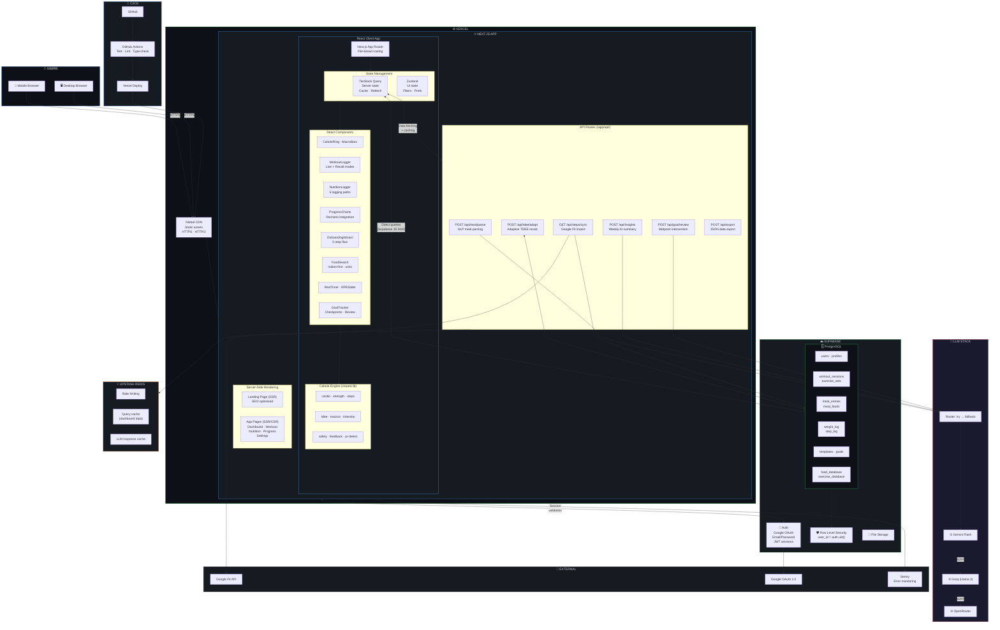

# 🏋️ FitLog — Production-Ready Architecture Redesign

> **What changed**: The previous plan treated this as a toy/MVP project — Vanilla JS, no database, features split into "phases" where Phase 1 was barely functional. That's scrapped. This is the real plan: a **production-grade, full-featured fitness website** built properly from day one.
>
> **Key principle**: The PROJECT has ALL features. Only the IMPLEMENTATION (build order) is staged.

---

## What Was Wrong With The Old Plan

| Old Decision | Why It Was Wrong | New Decision |
|-------------|-----------------|--------------|
| Vanilla JS | Not production-grade for a complex app. No component system, no type safety, no ecosystem. | **React (Next.js)** |
| Plain JavaScript | No type safety = bugs in production. Every serious codebase uses types. | **TypeScript** |
| Vanilla CSS | Maintainability nightmare at scale. No utility system. | **Tailwind CSS** |
| IndexedDB as primary storage | User clears browser = all data gone. No cross-device sync. Not a real database. | **Supabase PostgreSQL from day one** |
| Serverless functions "bolted on later" | Should be designed into the architecture, not added as an afterthought. | **Next.js API Routes (server-side) from day one** |
| Chart.js | Not React-native. Imperative API fights with React's declarative model. | **Recharts** (built for React) |
| No error monitoring | Production apps need observability. You can't fix what you can't see. | **Sentry** |
| No type-safe data fetching | Raw fetch() with no caching, no loading states, no error handling. | **TanStack Query** |
| No global state management | DOM manipulation instead of reactive state. | **Zustand** |
| Features split into "phases" | Phase 1 was a toy. Users got a half-baked product. | **One complete product. Implementation order is staged.** |

---

## The Production Tech Stack

### Frontend

| Layer | Technology | Version | Why This One |
|-------|-----------|---------|-------------|
| **Framework** | **Next.js** (App Router) | 15.x | React-based full-stack framework. SSR for landing page (SEO). API routes for backend. File-based routing. Industry standard in 2026. |
| **Language** | **TypeScript** | 5.x | Non-negotiable for production. Catches bugs at compile time. Every serious React codebase uses it. |
| **UI Library** | **React** | 19.x | You specifically asked for React. Component-based. Largest ecosystem. Most hireable skill. |
| **Styling** | **Tailwind CSS** | 4.x | Utility-first CSS. Consistent design system. Fast to build. Industry standard for React apps. |
| **Component Library** | **shadcn/ui** | Latest | Pre-built, customizable React components (buttons, modals, forms, tabs). Built on Radix UI primitives. Copy-paste, not a dependency. |
| **Server State** | **TanStack Query** | 5.x | Manages all data fetching: caching, background refetching, loading/error states, optimistic updates. Eliminates 80% of what you'd put in a global store. |
| **Client State** | **Zustand** | 5.x | Lightweight global state for UI (sidebar open, current filters, theme). Zero boilerplate. |
| **Charts** | **Recharts** | 2.x | React-native charting library. Declarative API that works WITH React, not against it. |
| **Forms** | **React Hook Form** + **Zod** | Latest | Type-safe form validation. Zod schemas shared between client and server. |
| **Icons** | **Lucide React** | Latest | Tree-shakeable SVG icons for React. |
| **Fonts** | **Google Fonts** (Inter + Outfit) | — | Via `next/font` — auto-optimized, no layout shift. |

### Why Next.js And Not React + Vite + Separate Express?

| Factor | Next.js (our choice) | React + Vite + Express |
|--------|---------------------|----------------------|
| **Codebase** | One repo, one deployment | Two repos, two deployments, CORS config |
| **SSR for SEO** | Built-in (landing page ranks on Google) | Must configure manually |
| **API routes** | Built-in `/app/api/` folder | Separate Express server to build and maintain |
| **Type sharing** | Same TypeScript types across client + server | Must publish shared types package |
| **Deployment** | One `git push` deploys everything | Must coordinate two deploys |
| **Learning curve** | Learn one framework | Learn React + Express + how to connect them |
| **Industry standard** | Most new production React apps use Next.js | Older pattern, still valid for large teams |

> **"But isn't Next.js serverless?"** — No. Next.js CAN deploy as serverless on Vercel, but it also runs as a **standalone Node.js server** (`next start`). You can deploy it on any VPS, Docker container, or cloud provider. It's a real server.

---

### Backend (Built Into Next.js)

| Layer | Technology | Why |
|-------|-----------|-----|
| **API Layer** | **Next.js Route Handlers** (`/app/api/`) | Server-side API routes. Same codebase as frontend. Type-safe end-to-end. |
| **Server Actions** | **Next.js Server Actions** | For mutations (create/update/delete). Direct function calls from React components to server. No manual fetch(). |
| **Validation** | **Zod** | Schema validation shared between client forms and server endpoints. One definition, two enforcements. |
| **Auth** | **Supabase Auth** (via `@supabase/ssr`) | Google OAuth + email/password. JWT session management. Server-side session validation. |
| **Rate Limiting** | **Upstash Rate Limit** | Redis-based rate limiting for API routes. Prevents abuse. Free tier: 10K requests/day. |
| **LLM Client** | **Custom with fallback chain** | Gemini Flash → Groq → OpenRouter. OpenAI-compatible API format. |

### Why Not Express / Fastify / Hono As A Separate Server?

For FitLog specifically:

- We don't have heavy background processing (no video, no ML training)
- We don't need WebSocket real-time (fitness logging is request-response)
- We're one team, not separate frontend/backend teams
- Next.js API routes handle everything we need
- Adding a separate server means: separate deployment, CORS, shared types package, two monitoring setups — complexity with zero benefit for our use case

If FitLog grows to need a separate backend (e.g., mobile app sharing the same API, heavy batch processing), we can extract the API routes into a standalone Fastify/Hono server THEN. Design for today, not for imaginary scale.

---

### Database

| Layer | Technology | Why |
|-------|-----------|-----|
| **Database** | **Supabase PostgreSQL** | Relational database. Our data IS relational (users → workouts → exercises → sets). SQL handles "average protein over 30 days" in one query. Free: 500MB, 50K MAU. |
| **ORM** | **Prisma** | Type-safe database client. Auto-generates TypeScript types from database schema. Migrations. |
| **Row Level Security** | **Supabase RLS** | Database-level access control. `user_id = auth.uid()` on every table. Even if code has bugs, data can't leak. |
| **Caching** | **Upstash Redis** | Cache frequent queries (today's dashboard data, food search results). Free: 10K commands/day. |

### Why Supabase PostgreSQL And Not Firebase / MongoDB / PlanetScale?

| Alternative | Why We Rejected It |
|------------|-------------------|
| **Firebase (Firestore)** | NoSQL. Our data is relational (users → workouts → sets). "Average protein over 30 days" requires reading every document in Firestore. In Postgres: one SQL query. Vendor lock-in (can't self-host). |
| **MongoDB Atlas** | Same NoSQL problem. Great for unstructured data (CMS, logs). Bad for structured fitness data where everything relates to everything. |
| **PlanetScale** | MySQL-based. Good, but no built-in auth. Need separate auth service. Supabase bundles database + auth + RLS + file storage. |
| **Neon** | Serverless Postgres. Technically excellent. But no auth, no RLS dashboard, no real-time. More DIY. Supabase is the all-in-one. |

---

### Infrastructure & DevOps

| Layer | Technology | Why |
|-------|-----------|-----|
| **Hosting** | **Vercel** | Deploy Next.js with one `git push`. Global CDN. Auto-HTTPS. Preview deployments per PR. Free tier: 100GB bandwidth/month. |
| **CI/CD** | **GitHub Actions** | Run tests, lint, type-check on every PR. Auto-deploy to Vercel on merge to main. |
| **Error Monitoring** | **Sentry** | Track errors in production. Stack traces, session replay, performance monitoring. Free: 5K events/month. |
| **Analytics** | **Vercel Analytics** OR **Plausible** | Privacy-friendly, no cookies. Track page views and core web vitals. |
| **Uptime Monitoring** | **Better Stack (formerly Better Uptime)** | Alerts if website goes down. Free tier available. |
| **Version Control** | **Git + GitHub** | Standard. PR reviews, branch protection, issue tracking. |

### Testing

| Type | Tool | What It Tests |
|------|------|--------------|
| **Unit Tests** | **Vitest** | Individual functions (calorie engine, TDEE calculator, helpers) |
| **Component Tests** | **React Testing Library** | React components render correctly, user interactions work |
| **E2E Tests** | **Playwright** | Full user flows: onboarding → log workout → check dashboard |
| **Type Checking** | **TypeScript `tsc`** | Compile-time type errors caught before deploy |
| **Linting** | **ESLint** + **Prettier** | Code quality and formatting |

---

### LLM Integration

| Role | Provider | Limits | Purpose |
|------|----------|--------|---------|
| **Primary** | **Gemini Flash** | 1,500 RPD, 10 RPM, 1M TPM | Meal parsing, weekly insights, goal intervention |
| **Fallback #1** | **Groq (Llama 3)** | 30 RPM, <1s latency | If Gemini rate-limited |
| **Fallback #2** | **OpenRouter** | 20+ free models | If both above fail |
| **Degradation** | **Template-based** | Unlimited | If all LLMs fail, use rule-based fallback |

All use OpenAI-compatible API format. LLM keys stored in server environment variables (never exposed to browser).

---

## Full System Design



---

## Project File Structure

```
fitlog/
├── app/                           # Next.js App Router
│   ├── layout.tsx                 # Root layout (fonts, providers, nav)
│   ├── page.tsx                   # Landing page (SSR, SEO)
│   ├── (auth)/                    # Auth routes (login, signup)
│   │   ├── login/page.tsx
│   │   └── signup/page.tsx
│   ├── (app)/                     # Authenticated app routes
│   │   ├── layout.tsx             # App layout (bottom nav, auth guard)
│   │   ├── dashboard/page.tsx
│   │   ├── workout/
│   │   │   ├── page.tsx           # Workout hub
│   │   │   ├── [id]/page.tsx      # Active session
│   │   │   └── history/page.tsx
│   │   ├── nutrition/
│   │   │   ├── page.tsx           # Nutrition hub
│   │   │   ├── search/page.tsx    # Food search
│   │   │   └── recipe/page.tsx    # Recipe builder
│   │   ├── progress/page.tsx
│   │   ├── onboarding/page.tsx
│   │   └── settings/page.tsx
│   └── api/                       # Server-side API routes
│       ├── meal/parse/route.ts
│       ├── insights/route.ts
│       ├── tdee/adapt/route.ts
│       ├── goal/review/route.ts
│       ├── steps/sync/route.ts
│       └── export/route.ts
├── components/                    # React components
│   ├── ui/                        # shadcn/ui base components
│   ├── dashboard/                 # Dashboard-specific
│   │   ├── calorie-ring.tsx
│   │   ├── macro-bars.tsx
│   │   ├── steps-ring.tsx
│   │   └── daily-summary.tsx
│   ├── workout/                   # Workout-specific
│   │   ├── exercise-card.tsx
│   │   ├── set-row.tsx
│   │   ├── rest-timer.tsx
│   │   ├── rpe-slider.tsx
│   │   └── session-summary.tsx
│   ├── nutrition/                 # Nutrition-specific
│   │   ├── food-search.tsx
│   │   ├── meal-combo-card.tsx
│   │   ├── recipe-builder.tsx
│   │   └── nlp-input.tsx
│   ├── progress/                  # Charts
│   │   ├── weight-trend.tsx
│   │   ├── strength-curve.tsx
│   │   ├── calorie-trend.tsx
│   │   └── intensity-ring.tsx
│   └── shared/                    # Shared components
│       ├── bottom-nav.tsx
│       ├── date-picker.tsx
│       └── loading-skeleton.tsx
├── lib/                           # Shared libraries
│   ├── supabase/
│   │   ├── client.ts              # Browser Supabase client
│   │   ├── server.ts              # Server Supabase client
│   │   └── middleware.ts          # Auth middleware
│   ├── engine/                    # Calorie engine (pure functions)
│   │   ├── cardio.ts
│   │   ├── strength.ts
│   │   ├── steps.ts
│   │   ├── tdee.ts
│   │   ├── macros.ts
│   │   ├── intensity.ts
│   │   ├── safety.ts
│   │   ├── feedback.ts
│   │   ├── pr-detector.ts
│   │   └── index.ts
│   ├── llm/
│   │   ├── router.ts              # LLM stacking (Gemini → Groq → OR)
│   │   ├── prompts.ts             # System prompts for meal parsing
│   │   └── schemas.ts             # Zod schemas for LLM responses
│   ├── validators/
│   │   └── schemas.ts             # Shared Zod schemas (client + server)
│   └── utils/
│       ├── constants.ts           # MET tables, macro ratios
│       ├── helpers.ts             # Date formatting, calculations
│       └── cn.ts                  # Tailwind class merge utility
├── hooks/                         # Custom React hooks
│   ├── use-meals.ts               # TanStack Query: meal operations
│   ├── use-workouts.ts            # TanStack Query: workout operations
│   ├── use-profile.ts             # TanStack Query: user profile
│   ├── use-weight.ts              # TanStack Query: weight log
│   └── use-steps.ts               # TanStack Query: step log
├── stores/                        # Zustand stores (client UI state)
│   ├── ui-store.ts                # Sidebar, modals, current date
│   └── workout-store.ts           # Active workout session state
├── prisma/
│   ├── schema.prisma              # Database schema definition
│   └── seed.ts                    # Seed data (exercises, foods)
├── public/                        # Static assets
│   ├── icons/
│   └── manifest.json              # PWA manifest
├── tests/
│   ├── unit/                      # Vitest unit tests
│   ├── components/                # React Testing Library
│   └── e2e/                       # Playwright E2E tests
├── .github/
│   └── workflows/
│       └── ci.yml                 # GitHub Actions CI/CD
├── next.config.ts
├── tailwind.config.ts
├── tsconfig.json
├── package.json
└── .env.local                     # Environment variables (never committed)
```

---

## Implementation Order (NOT Feature Phases)

The PRODUCT is complete — all features exist in the design. But you BUILD it in this order because some things depend on others:

### Step 1: Foundation (Week 1-2)
Everything else depends on this. No features, just plumbing.
- [ ] Initialize Next.js + TypeScript + Tailwind + shadcn/ui
- [ ] Set up Supabase project (database + auth)
- [ ] Prisma schema (ALL tables — entire database, not a subset)
- [ ] Supabase Auth integration (Google OAuth + email)
- [ ] Protected route middleware (auth guard)
- [ ] Bottom navigation component
- [ ] CI/CD pipeline (GitHub Actions → Vercel)
- [ ] Sentry error monitoring setup
- [ ] Design system tokens (colors, spacing, typography)

### Step 2: Core Data (Week 3-4)
Seed the databases. Build the calorie engine.
- [ ] Food database (IFCT + USDA → seed into PostgreSQL)
- [ ] Exercise database (150+ exercises → seed into PostgreSQL)
- [ ] Calorie engine (all calculators — cardio, strength, steps, TDEE, intensity, safety)
- [ ] Onboarding wizard (5 steps → writes profile to Supabase)
- [ ] TanStack Query hooks (all data fetching hooks)

### Step 3: Features — Build All (Week 5-10)
Build every feature. No "Phase 1" subset.
- [ ] Dashboard (calorie ring, macro bars, steps ring, intensity ring, daily summary)
- [ ] Workout Logger — Live Mode (timer, set logging, rest timer, RPE)
- [ ] Workout Logger — Recall Mode (date picker, session duration, RPE)
- [ ] Session summary (calories burned range, volume, PR detection)
- [ ] Nutrition Logger — Search path (Indian-first, household units, homemade/restaurant)
- [ ] Nutrition Logger — Combo path (pre-built meal combos)
- [ ] Nutrition Logger — Recipe builder (save custom recipes)
- [ ] Nutrition Logger — Repeat path (repeat recent meals)
- [ ] Nutrition Logger — NLP path (type text → LLM parses → review → confirm)
- [ ] Step logging (manual + Google Fit sync)
- [ ] Weight logging
- [ ] Progress page (weight trend, strength curves, calorie trends, intensity minutes)
- [ ] Strictness-based feedback system (Relaxed/Moderate/Strict)
- [ ] Safety floor alerts (sub-1200/1500 cal detection)
- [ ] Adaptive TDEE (weekly recalculation from real data)
- [ ] Weekly AI insights (plain-language summaries)
- [ ] Goal tracking (set goal, progressive checkpoints, midpoint LLM review)
- [ ] Settings (profile, strictness, splits, units, export/import)

### Step 4: Polish (Week 11-12)
Make it feel premium.
- [ ] Animations (ring fill, bar transitions, page transitions, PR celebrations)
- [ ] PWA support (installable, offline indicator)
- [ ] Responsive design audit (mobile, tablet, desktop)
- [ ] Performance optimization (code splitting, image optimization, Lighthouse audit)
- [ ] E2E tests (Playwright — full user flows)
- [ ] Security audit (CSP headers, RLS testing, input sanitization)
- [ ] SEO (meta tags, Open Graph, structured data for landing page)

---

## Production Costs

| Service | Free Tier | When You Pay |
|---------|-----------|-------------|
| **Vercel** | 100GB bandwidth, unlimited deploys | $20/mo when >100GB |
| **Supabase** | 500MB database, 50K MAU, 1GB storage | $25/mo when >500MB |
| **Upstash Redis** | 10K commands/day | $0.2/100K commands |
| **Sentry** | 5K errors/month | $26/mo when >5K |
| **Gemini Flash** | 1,500 RPD | ~$0.075/1M tokens |
| **Groq** | 30 RPM | Pay-as-you-go |
| **GitHub** | Unlimited (public/private repos) | Never for our use |
| **Total (0–5K users)** | **₹0/month** | |
| **Total (5K–50K users)** | | **~₹5,000–10,000/month** |

---

## Open Questions For You

> [!IMPORTANT]
> Before I update ALL the other documents (CONTEXT.md, implementation_plan.md, tech_stack_cross_questions.md, system_design.md) to match this new architecture, I need your confirmation:

1. **Next.js** — Are you comfortable with Next.js? It IS React (you asked for React), but it adds server-side features on top. If you specifically want React + separate Express backend, I'll redesign for that instead.

2. **Tailwind CSS** — Are you OK with Tailwind? Some developers prefer CSS Modules or styled-components. Tailwind is the industry standard but if you have a preference, tell me.

3. **TypeScript** — This is non-negotiable for production. Just confirming you're on board.

4. **Prisma vs Drizzle** — Both are excellent TypeScript ORMs for PostgreSQL. Prisma is more established; Drizzle is lighter and SQL-closer. I chose Prisma. Any preference?

5. **Project name** — Still "FitLog"? Or do you have a different name?
